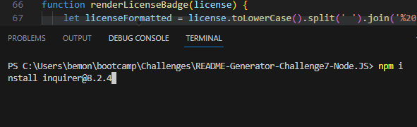
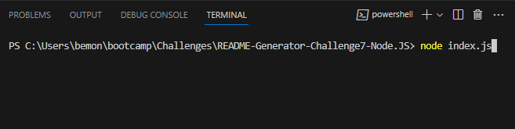
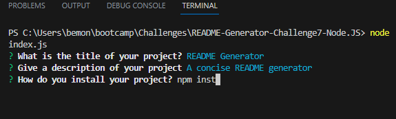
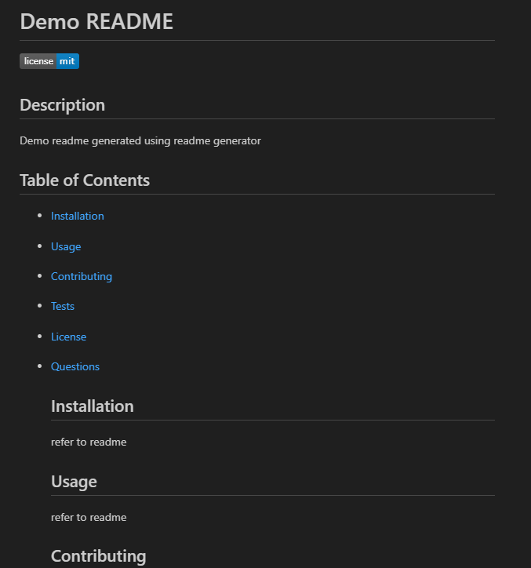
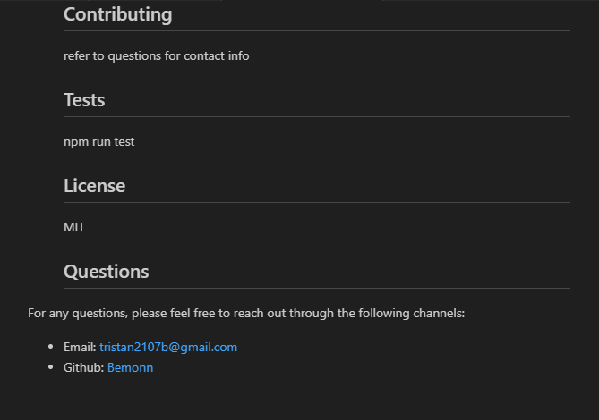

# README-Generator-Challenge7-Node.JS
  

  ## Description
  A high quality README generator allowing users to streamline the process of making a README by giving the individual easy to answer questions from which a detailed README is generated allowing for more time to focus on code itself

  ## Table of Contents
- [Installation](#installation)
- [Usage](#usage)
- [Walkthrough-Video](#walkthrough-video)
- [Contributing](#contributing)
- [Tests](#tests)
- [License](#license)
- [Questions](#Questions)
  
  ## Installation
  npm install inquirer@8.2.4 is needed to be installed to get node_modules
  
  
  ## Usage
  run "node index.js" in the intergrated terminal, 
  
  User will then be prompted with questions for README generation
  
  this will make a folder named "Generated README" if one does not already exist and then the generated README will be put inside.
  Demo readme:
  
  

  ## Walkthrough Video
   https://drive.google.com/file/d/1-jhWC1F_hoQrse_z45BXoPTtlZTAfyZ-/view 
  
  ## Contributing
  refer to "Questions" for contact information to contribute
  
  ## Tests
  npm run test
  
  ## License
  MIT

  ## Questions
For any questions, please feel free to reach out through the following channels:
- Email: tristan2107b@gmail.com
- Github: [Bemonn](https://github.com/Bemonn)